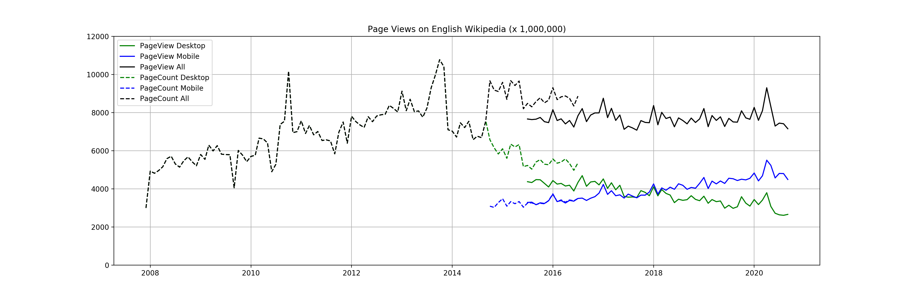

# DATA512-A1-Data_Curation

In this project, we aim to collect the Wikipedia traffic data with the REST APIs and create visualization to compare view counts via different access types.

## API Documentation
Documentations for both APIs:
- the Legacy Pagecounts API: [Documentation](https://wikitech.wikimedia.org/wiki/Analytics/AQS/Legacy_Pagecounts)
- the Pageviews API: [Documentation](https://wikitech.wikimedia.org/wiki/Analytics/AQS/Pageviews)

## Directory Structure

```bash
├── CSV
│   └── en-wikipedia_traffic_200712-202010.csv
├── JSON
│   ├── pagecounts_desktop-site_200712-201608.json
│   ├── pagecounts_mobile-site_200712-201608.json
│   ├── pageviews_desktop_201507-202010.json
│   ├── pageviews_mobile-app_201507-202010.json
│   └── pageviews_mobile-web_201507-202010.json
├── .gitattributes
├── DATA512-A1_Data_Curation-Jiyu Wang.ipynb
├── LICENSE
├── README.md
└── pageviews_wikipedia.png
```
## Data File Info
The dataset collected has been processed into a [csv file](CSV/en-wikipedia_traffic_200712-202010.csv).

| Column | Description |
|---|---|
| year | The year of the data point (format: YYYY) |
| month | The year of the data point (format: MM) |
| pagecount_all_views | Counts of all visits from Pagecounts API |
| pagecount_desktop_views | Counts of desktop visits from Pagecounts API |
| pagecount_mobile_views | Counts of mobile visits from Pagecounts API |
| pageview_all_views | Counts of all visits from Pageviews API |
| pageview_desktop_views | Counts of desktop visits from Pageviews API |
| pageview_mobile_views | Counts of mobile visits from Pageviews API |

## Visualization
The process of collecting data and analyzing is documented in this [Jupyter notebook](DATA512-A1_Data_Curation-Jiyu Wang.ipynb).

The created visualization to compare the view counts of different access type from both APIs is shown below:


The counts of pageview is always not larger than the counts of pagecounts, since pageview data excludes visits from spiders/crawlers.

While the total page views stay approximately the same, more and more views are switching from desktop to mobile visits.

## Miscellaneous
- The "pagecount" is the legacy definition of "pageview", which includes automated traffic from self-reported bots, while the "pageview" API filters these bots and only reports human traffic.
- The mobile counts of pageviews are the sum of both mobile-web and mobile-app visits.

## License
This project is under the [MIT License](LICENSE)

Please check [Terms of Use](https://www.mediawiki.org/wiki/REST_API#Terms_and_conditions) of the Wikimedia Foundation REST API.

