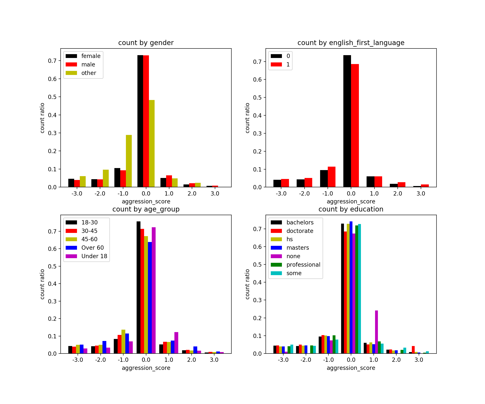
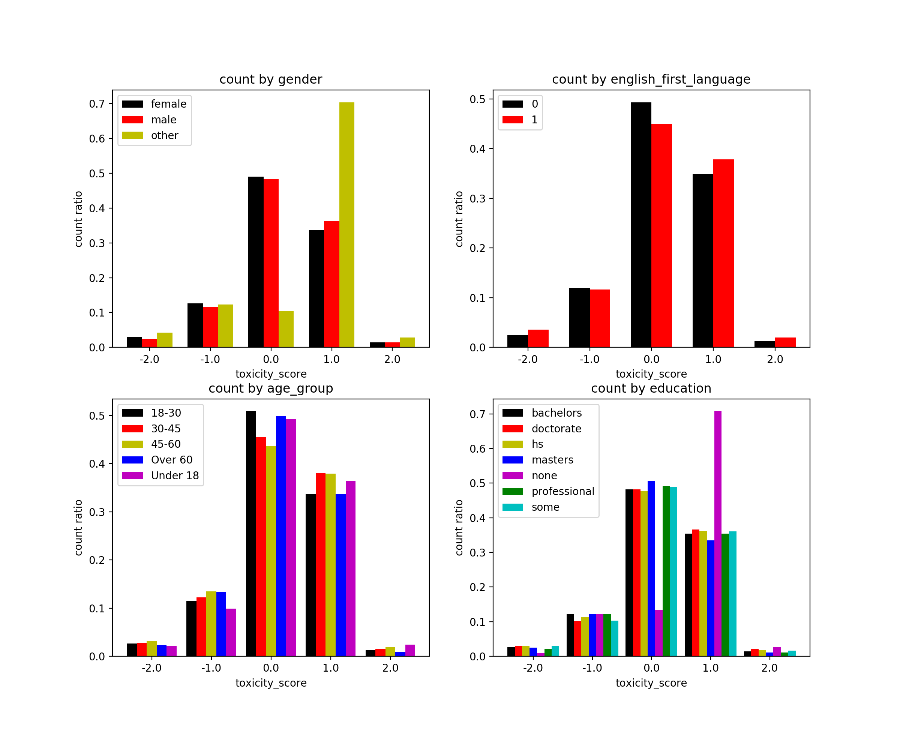
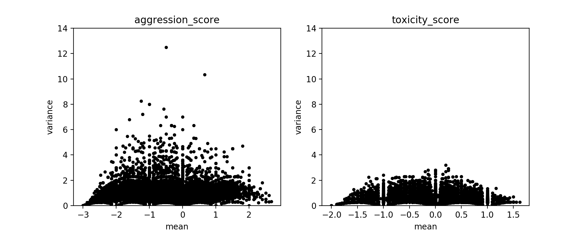

# DATA512-A2-Data_Bias

In this assignment, we are trying to identify potential sources of bias in the Wikipedia Talk corpus and describe some implications of the biases.

## Datasets and Documentations
The [Wikipedia Talk corpus](https://figshare.com/projects/Wikipedia_Talk/16731) contains three datasets, each of which contains thousands of online discussion posts discussing how to write and edit Wikipedia articles. Crowdworkers have labelled these posts for three kinds of hostile speech: 'toxicity', 'aggression', and 'personal attacks'.

Basic informations of these datasets can be found in the [wiki page](https://meta.wikimedia.org/wiki/Research:Detox).

These annotated datasets were used to train machine learning models as part of a project called [Conversation AI](https://conversationai.github.io/). The models have been used in a variety of software products and made freely accessible to anyone through the [Perspective API](https://github.com/conversationai/perspectiveapi/wiki/perspective-hacks). 

## Directory Structure

```bash
├── csv
│   ├── aggression_joined.csv
│   └── toxicity_joined.csv
├── .gitattributes
├── hcds-a2-data-bias.ipynb
├── LICENSE
├── README.md
├── aggression_score_demo.png
├── comment_mean_var.png
└── toxicity_score_demo.png
```

## Analysis Result
The process of data collection and analysis as well as discussions on the result is documented in this [Jupyter notebook](hcds-a2-data-bias.ipynb).

### How consistent are labelling behaviors among workers with different demographic profiles?
For aggression dataset:


For toxicity dataset:


### What is the level of disagreement around certain labels in different datasets?
For both datasets:


## License
This project is under the [MIT License](LICENSE)
